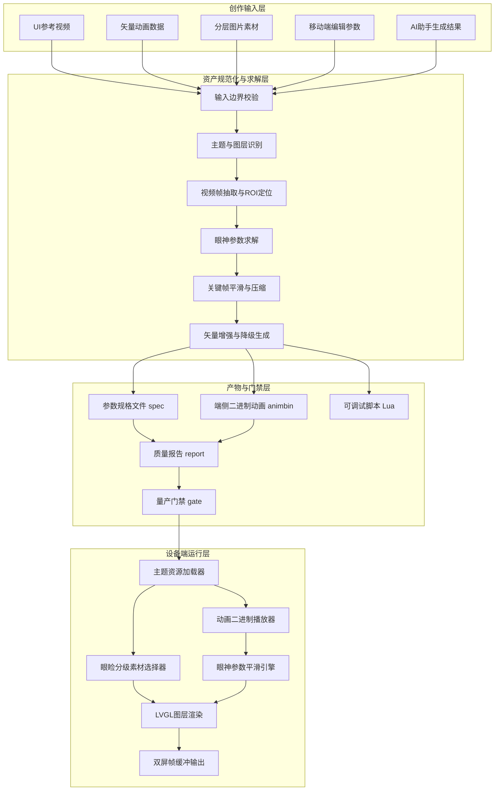
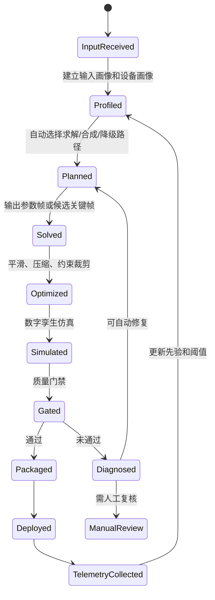
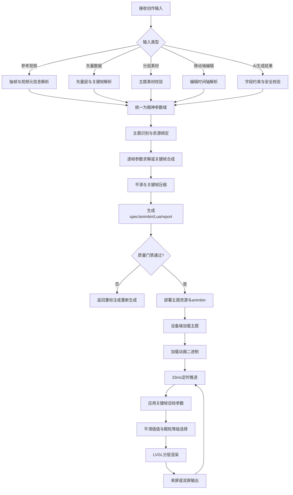

# 技术交底书

**案件名称**：一种多源创作输入驱动的端侧轻量化眼神动画生成显示方法及系统

**技术联系人**：
- 姓名：雷文军
- 电话：15814082410
- 邮箱：wenjun.lei@videostrong.com

**专利类型**：发明

---

## 注意事项

（1）本交底书围绕“眼神动画创作输入、资产生成、质量校验、端侧轻量播放”的完整技术链路展开，便于代理人理解本方案相对单纯视频播放、逐帧图片播放、通用 Lottie 播放或单一 JSON 关键帧播放方案的区别。

（2）本文中的设备端可以是具有一个或多个眼部显示屏的机器人、陪伴设备、智能玩具、桌面交互终端或其它嵌入式显示设备；其中一个优选实施例为双眼显示的宠物陪伴机器人。

（3）本文中的“眼神动画”不局限于真实人眼，可包括仿人、仿猫、机器人、猎物化或卡通化眼部表达；眼白、虹膜、瞳孔、眼睑、高光、装饰层等仅为典型图层划分。

## 一、介绍相关技术背景，描述与本发明技术最相近的现有技术，并说明该现有技术存在的缺点

### 1.1 现有技术

检索说明：在 Google Patents、Justia Patents、LVGL 官方文档及公开组件说明中，以“robot eye animation display”“eye animated expression robot JSON layers”“LVGL Lottie embedded memory”“video to animation parameters”等为检索词进行检索，并结合本案的多源输入、参数资产生成、端侧显示约束进行比对。

| 序号 | 现有技术方向 | 公开资料及链接 | 技术方案概括 | 与本案相关的局限 |
| --- | --- | --- | --- | --- |
| 1 | 机器人眼部多图层 JSON 动画 | US10957090B2《Eye animated expression display method and robot using the same》，Google Patents：https://patents.google.com/patent/US10957090B2/en；Justia：https://patents.justia.com/patent/10957090 | 该方案接收眼部动画显示指令，解析存储眼部动画表情的 JSON 文件，基于多图层、关键帧和变化参数在机器人眼部显示屏上显示眼部动画；图层可包括上眼睑、下眼睑、眼白、虹膜、反射层、高光等。 | 该方案重点在于解析已有 JSON 并按关键帧/插值显示，未公开如何把 UI 设计视频、矢量数据、分层素材、移动端编辑数据或 AI 生成结果统一转换为受端侧内存和帧率约束的轻量资产；也未强调质量门禁、自动主题识别、二进制运行资产、端侧禁播视频和降级策略的闭环。 |
| 2 | 嵌入式 LVGL Lottie 播放 | LVGL Rlottie 文档：https://lvgl.io/docs/open/9.1/libs/rlottie | LVGL 可通过 Rlottie 从文件或原始数据创建 Lottie 动画对象，并提供播放、暂停、循环等控制；官方文档也指出嵌入式设备上 Lottie 可能消耗较多 CPU 和 RAM，需要限制帧数、尺寸和复杂度。 | 该方向提供矢量动画播放能力，但它本身不是面向眼神动画生产的多源转换系统；在内存受限设备上，复杂 Lottie 可能不可稳定运行，缺少从 Lottie/视频自动降级为分层位图参数动画、并在端侧按质量门禁选择播放路径的机制。 |
| 3 | LVGL Lottie 组件化播放器 | Espressif `esp_lv_lottie_player` 组件说明：https://components.espressif.com/components/espressif/esp_lv_lottie_player/versions/0.1.0/readme?language=en | 该组件为 LVGL v8/v9 提供 Lottie 播放能力，支持文件和内存数据源、播放控制、循环、片段播放及内部或用户提供的绘制缓冲。 | 该方向仍以 Lottie 作为播放对象，解决的是通用动画渲染控件问题；未解决眼部表达的素材分层、主题资源映射、视频参考求解、参数压缩、眼睑分级替换、双屏同步和设备端二进制资产播放问题。 |
| 4 | 通用设计工具或动画视频交付 | 设计师使用 AE、视频导出、GIF 或逐帧 PNG 序列向嵌入式端交付动画 | 该类方案通常以视频、动图、全帧序列或通用矢量动画作为最终交付物，显示端直接播放或逐帧刷新。 | 对无硬件 2D 加速、Flash 和 DDR 均受限的设备不友好：逐帧资产占用大、解码和带 Alpha 混合成本高，无法自然接收传感器状态实时驱动；如果直接播放视频，也难以在眼球跟随、情绪状态抢占、双屏同步和低功耗休眠中做细粒度控制。 |

### 1.2 现有技术存在的缺点

现有机器人眼神显示方案大致分为两类：一类是解析预制 JSON、Lottie 或关键帧文件并显示；另一类是直接播放视频、GIF 或图片序列。前者解决了“如何播放已有动画描述”的问题，但没有解决“如何让 UI 视频、矢量设计、素材切图、移动端编辑和 AI 生成结果可靠变成端侧可运行资产”的问题；后者创作直观，但会把视频解码、全帧存储或大图混合压力转嫁给设备端。

在嵌入式机器人场景中，眼神动画还面临以下具体问题：

1. 创作输入形态不统一：设计师可能给参考视频、AE/Lottie 矢量数据、分层 PNG，用户可能通过手机端拖拽编辑，AI 助手可能生成描述、关键帧或素材；现有技术缺少将这些输入统一成同一端侧动画资产模型的机制。
2. 端侧资源约束强：对于无硬件 2D 加速且内存较小的设备，直接播放视频、复杂 Lottie 或长序列 PNG 容易造成 Flash 占用、RAM 峰值、解码耗时和掉帧问题。
3. 动画还原缺少闭环：视频或 AI 生成结果如果没有自动求解、关键帧压缩和质量报告，研发人员只能人工调坐标、调节奏，难以批量生产和回归。
4. 缺少面向“眼神”的专用层模型：通用动画播放器并不理解眼白、虹膜、瞳孔、眼睑、高光之间的联动，也不理解眼睑分级素材、瞳孔聚缩、注视偏移、眨眼、惊吓、低电量困倦等眼神表达参数。
5. 缺少端云协同边界：若 AI 或移动端只生成高层创意，设备端仍需要确定可执行的安全资产格式和降级策略，避免把不可控的大模型输出、长视频或复杂矢量直接塞进运行链路。

## 二、针对上述缺点，说明本发明所要解决的技术问题

本发明要解决的技术问题是：在存储、内存、图形加速能力受限的嵌入式显示设备上，如何把来自 UI 设计视频、矢量动画、分层素材、移动端编辑和 AI 助手生成的多源创作输入，自动或半自动转换为可在设备端稳定运行的轻量化眼神动画资产，并在设备端以低内存、低解码成本、可被传感器和系统状态抢占的方式显示高质量眼神动画。

进一步地，本发明还要解决以下子问题：

1. 如何约束设计输入，使视频只作为视觉对齐参考，而非设备端运行时资产。
2. 如何把参考视频中的眼球位移、缩放、眼睑开合、情绪节奏等视觉特征转换为结构化参数帧。
3. 如何将参数帧压缩为关键帧、规格文件和二进制播放资产，减少设备端解析成本。
4. 如何把矢量动画作为增强通道，同时在性能不足时降级为分层位图参数动画。
5. 如何支持移动端编辑和 AI 助手生成的高层意图，并将其约束到同一参数模型和质量门禁中。
6. 如何在端侧依据主题、动画、资源路径和环境变量加载不同眼神，并通过 30fps 定时器、平滑插值、眼睑分级素材和双屏帧缓冲刷新实现稳定显示。
7. 如何让系统自动识别输入质量问题、自动选择求解算法和降级路径、自动生成修复建议，减少人工反复调参。
8. 如何把端侧运行日志、掉帧、内存峰值和用户反馈反向用于下一轮参数优化，形成“生成、仿真、门禁、部署、反馈、再优化”的闭环。

## 三、本发明技术方案的详细阐述

### 3.1 背景

本发明提出一种多源创作输入驱动的端侧轻量化眼神动画生成显示方法及系统。该系统将“创作端”和“设备端”解耦：创作端负责接收多源输入、抽取视觉参数、生成轻量资产并进行质量校验；设备端只加载分层素材和参数化动画资产，不直接播放视频，并优先使用预编译二进制动画资产进行播放。

优选地，系统将眼神动画拆分为以下层和参数：

1. 图层：眼白层、虹膜层、瞳孔层、上眼睑层、下眼睑层、高光层、背景层、装饰层。
2. 基础参数：时间戳、图层 ID、X/Y 偏移、缩放、透明度、旋转、眼睑高度。
3. 形变参数：网格角点偏移、局部挤压、瞳孔非均匀缩放、眼睑遮挡等级。
4. 质量参数：识别置信度、时序连续性、运动强度、转场比例、是否通过门禁、是否存在端侧二进制资产。

其中，创作输入可以包括：

1. UI 设计视频：用于对齐节奏、姿态、情绪和关键画面，不进入设备运行时渲染链。
2. 矢量数据：如 Lottie JSON 或 AE/Bodymovin 派生数据，用于复杂形变或增强效果。
3. 分层素材：如眼白、虹膜、瞳孔、眼睑、高光等 PNG 或离线转换后的像素资产。
4. 移动端编辑数据：用户在手机端通过滑块、拖拽、时间轴或模板组合生成的参数配置。
5. AI 助手生成数据：AI 根据文字提示或参考图生成主题建议、关键姿态、参数曲线、素材草稿或动画片段。

上述输入被统一映射到“主题资源 + 参数动画 + 质量报告 + 端侧运行资产”的资产包中。设备端只需要读取主题资源目录和动画二进制文件，即可在单眼或双眼屏幕上播放。

### 3.2 系统框图


<!--  -->

### 3.3 模块功能说明

#### 3.3.1 输入边界校验模块

输入边界校验模块用于区分“参考素材”和“运行素材”。当用户或设计师上传视频、GIF 或 WebM 时，系统将其标记为视觉参考，仅允许进入视频求解链路；当用户上传分层图片、矢量数据或参数文件时，系统检查其是否满足主题目录、图层命名、帧率、尺寸和参数字段要求。

该模块的核心作用是阻断不适合设备端直接播放的高负载文件进入运行时资源包，确保最终部署包只包含分层素材、参数文件、二进制动画资产和必要的可选矢量增强文件。

#### 3.3.2 多源创作输入适配模块

该模块将不同来源的创作输入映射为统一中间表示：

1. 对 UI 参考视频，抽取帧序列、视频元信息和候选眼部区域。
2. 对矢量数据，读取图层名、关键帧、路径或缩放信息，并转换为眼部参数或可选增强资源。
3. 对分层素材，识别主题名称、图层尺寸、Alpha 区域和眼睑可用等级。
4. 对移动端编辑数据，读取时间轴上用户配置的注视点、眨眼、瞳孔缩放、情绪模板和持续时间。
5. 对 AI 助手生成数据，先进行字段约束和安全校验，再映射到主题、图层、关键帧、缓动曲线和素材草稿。

由此，系统不要求所有输入来源直接生成设备代码，而是要求它们进入同一“眼神参数域”。

#### 3.3.3 主题与图层识别模块

该模块根据资源目录中的眼部主题素材自动扫描可用主题，并可根据参考视频帧与已知虹膜、眼白等模板的匹配程度推断主题。当用户强制指定主题时，系统按指定主题进行处理；未指定时，系统优先通过视觉匹配推断，失败后再采用文件名或默认主题策略。

该模块使同一套视频或编辑数据能够根据猫、机器人、人、老鼠等不同主题生成不同的端侧资产，同时避免因主题资源缺失导致运行时加载失败。

#### 3.3.4 视频到眼神参数求解模块

该模块从参考视频中提取帧，以固定帧率进行采样，结合眼部 ROI 和主题先验，求解每一帧的眼神参数。优选参数包括：全局缩放、眼白偏移、虹膜/瞳孔偏移、上眼睑高度、下眼睑高度、置信度、模型置信度、特征置信度和时序置信度。

当设备端的目标帧率为 30fps 时，视频求解模块可按 33ms 的时间基准输出参数帧，使创作端时间轴与设备端定时器一致。

#### 3.3.5 平滑、压缩与长等待折叠模块

该模块对求解出的参数帧进行时序平滑，减少抖动；再根据参数变化阈值压缩为关键帧。对于连续多帧未发生显著变化的区间，将其折叠为保持段或等待段，以降低设备端播放时的指令数量和解析负担。

在优选实现中，系统对缩放、虹膜偏移、眼白偏移、上眼睑高度和下眼睑高度分别设置变化阈值，并设置最大保持时间，避免长时间静止导致关键帧过少而影响状态恢复。

#### 3.3.6 端侧运行资产生成模块

该模块将关键帧生成至少三类产物：

1. 参数规格文件：用于审计、调试和复现完整参数轨迹。
2. 二进制动画文件：用于设备端快速读取和播放，包含魔数、版本、帧率、帧数和定长关键帧记录。
3. 调试脚本：用于开发阶段在脚本运行时快速回放。

二进制动画文件中的每个关键帧可包含时间戳、缩放值、眼白偏移、虹膜偏移、上眼睑高度和下眼睑高度。设备端读取后无需解析 JSON，也无需在运行时进行复杂视频解码或矢量解析。

#### 3.3.7 质量报告与量产门禁模块

该模块根据求解结果生成质量报告，报告可包括总帧数、关键帧数、平均置信度、最低置信度、P10 置信度、中位置信度、运动强度、转场比例、动态指数、端侧二进制文件是否存在等字段。

量产门禁模块读取报告集合，判断批量动画是否全部成功、质量是否达标、二进制资产是否完整。若任一动画失败或低于阈值，则阻止进入量产资产包，避免低质量或不完整动画部署到设备。

#### 3.3.8 端侧主题资源加载模块

设备端主题资源加载模块根据主题名称查找眼部资源目录，加载背景、眼白、虹膜、瞳孔、高光和眼睑素材，并将图层对象注册到眼神参数平滑引擎。优选地，设备端支持通过环境变量或配置项切换主题资源根目录，以便在出厂包、系统升级包或调试包之间切换。

#### 3.3.9 眼睑分级素材选择模块

对于覆盖式眼睑，系统不强制逐帧存储眼睑动画，而是在主题资源中提供若干按高度命名的上眼睑和下眼睑素材。播放时，设备端根据当前关键帧中的眼睑高度选择最接近的素材等级，并通过位置对齐方式表现眨眼、半闭眼、困倦和警觉状态。

这种方式可把连续眼睑运动从大量帧图像降为少量等级素材和一个高度参数。

#### 3.3.10 动画二进制播放器与平滑引擎

设备端动画播放器负责读取二进制动画文件，按时间戳推进关键帧。当播放时间达到下一关键帧时间时，将目标参数写入眼神平滑引擎。平滑引擎以固定周期执行，将当前参数逐步逼近目标参数，并应用到 LVGL 图层对象。

这样既可播放离线生成的参数动画，也可叠加传感器或系统状态产生的目标参数，例如人脸跟随、猫咪警觉、低电量困倦、系统升级状态、配网状态、被拿起或倾倒状态。

#### 3.3.11 双屏输出与端侧降级模块

在双眼显示设备中，系统可采用同显、镜像或异显模式输出。对于无硬件 2D 加速设备，优选使用分层图片和参数变换，避免全屏视频解码；当矢量增强效果的 CPU 或内存成本过高时，系统自动使用位图参数动画降级资产。

#### 3.3.12 智能编排与自动化决策模块

智能编排与自动化决策模块用于根据输入类型、素材完整度、端侧硬件能力、目标情绪和质量门禁结果，自动选择处理路径。该模块不是简单的脚本流水线，而是包含“能力画像、任务分解、算法选择、失败回退和证据记录”的决策器。

优选地，系统为每个设备维护能力画像 `device_profile`，字段包括屏幕分辨率、目标帧率、可用 DDR、Flash 限额、是否有 2D/GPU 加速、是否允许 Lottie、最大图层尺寸、最大关键帧数量、最大单动画时长、是否双屏异显等。系统为每个输入维护素材画像 `asset_profile`，字段包括输入来源、图层完整度、矢量复杂度、视频帧率、运动强度、遮挡比例、主题匹配分、AI 输出可信度和人工确认状态。

智能编排器基于上述画像自动选择如下路径：

1. 当输入为高质量视频且主题素材完整时，选择视频求解路径，并启用视觉主题识别和关键帧压缩。
2. 当输入为移动端编辑时间轴时，跳过视频求解，直接进行参数合成、约束裁剪和仿真门禁。
3. 当输入为 AI 生成的自然语言或草案参数时，先调用结构化解析器生成候选参数，再进行范围约束、曲线平滑和多候选排序。
4. 当矢量动画复杂度低于设备阈值时，将其作为增强资源；超过阈值时，自动采样为参数曲线或分级位图。
5. 当质量门禁失败时，根据失败原因自动进入重求解、重平滑、补素材、降级、重新生成提示词或人工复核中的一种或多种路径。

该模块输出的不仅是最终资产，还包括自动化决策记录，例如“为何选择二进制动画而非 Lottie”“为何强制降低关键帧数量”“为何退回 AI 重新生成”等。这些记录可进入质量报告，便于专利实施、量产审计和问题追踪。

#### 3.3.13 多模态 AI 助手约束生成模块

多模态 AI 助手约束生成模块用于把自然语言、参考图、历史模板和用户意图转换为可验证的眼神动画参数，而不是直接输出任意代码或任意视频。该模块至少包括语义解析、情绪标签映射、参数草案生成、素材草图生成、字段白名单校验和多候选排序。

例如，用户输入“生成一个看到主人后先惊喜、再温柔慢眨眼的眼神”，AI 助手先解析为情绪阶段序列：

```json
[
  {"phase": "surprise", "start_ms": 0, "end_ms": 350, "pupil_zoom": 310, "blink": false},
  {"phase": "soft_gaze", "start_ms": 350, "end_ms": 1800, "iris_x": 0, "blink": "slow"}
]
```

随后系统将语义阶段映射为图层参数，例如瞳孔瞬时放大、虹膜轻微回中、上眼睑慢速闭合和高光轻微跟随。AI 输出必须通过以下约束：

1. 图层字段必须属于预定义集合，禁止生成未注册的运行时对象。
2. 参数范围必须满足设备能力画像，例如偏移不超过屏幕安全区域，缩放不超过图层尺寸和内存预算。
3. 时间轴必须单调递增，单段时长不能超过端侧最大动画时长。
4. AI 生成素材必须通过尺寸、Alpha 边界、透明像素比例和主题一致性校验。
5. AI 生成的多个候选动画必须经过仿真评分和质量门禁排序，默认部署最高分候选。

由此，AI 助手成为受约束的创作输入源，而不是绕过端侧资源限制的直接代码生成器。

#### 3.3.14 自动质量诊断与自修复模块

自动质量诊断与自修复模块用于在求解或仿真失败时自动定位原因并生成修复动作。该模块将失败原因分为输入缺陷、求解缺陷、资产缺陷、性能缺陷和端侧兼容缺陷五类。

| 失败类别 | 典型检测指标 | 自动修复动作 |
| --- | --- | --- |
| 输入缺陷 | 视频过长、帧率异常、分辨率过高、主题缺失 | 自动抽样、裁剪、降采样、提示补主题 |
| 求解缺陷 | 置信度低、时序跳变大、遮挡严重 | 切换 ROI、增大平滑窗口、启用模板匹配或请求重标注 |
| 资产缺陷 | 缺少瞳孔/眼睑图层、Alpha 边界过大 | 自动生成占位层、提示设计师补图、裁剪透明边界 |
| 性能缺陷 | 关键帧过多、图层过大、矢量复杂度高 | 关键帧再压缩、图片降采样、Lottie 降级 |
| 兼容缺陷 | 二进制版本不匹配、端侧资源路径不存在 | 重新导出版本、改写资源清单、回退默认主题 |

优选地，该模块每次只执行可验证的修复动作，并重新生成报告。若连续多次修复仍无法通过门禁，则进入人工复核状态，报告中记录失败样例、候选修复、未通过的阈值和建议操作。

#### 3.3.15 数字孪生仿真与自动回归模块

数字孪生仿真与自动回归模块用于在部署到真实设备前，对生成资产进行像素级或参数级仿真。仿真端使用与设备端相同的图层模型、帧率、关键帧推进逻辑和平滑系数，对每个动画执行以下检查：

1. 帧率稳定性检查：模拟 30fps 推进，统计每帧参数计算和渲染预算。
2. 图层边界检查：检测虹膜、瞳孔、眼睑和高光是否越界或遮挡异常。
3. 情绪阶段检查：确认惊喜、警觉、慢眨眼、困倦等阶段的关键参数是否达到目标区间。
4. 端侧资源检查：确认 `.animbin`、主题图层、眼睑等级和可选矢量增强文件均可解析。
5. 回归差异检查：将新版本动画与参考视频、上一版本或金标参数进行对比，输出差异评分。

仿真结果参与量产门禁；若仿真不通过，系统不得宣称资产可部署。该模块使眼神动画从“人工观看觉得差不多”转为“可量化、可回归、可追溯”的自动验证。

#### 3.3.16 端侧遥测反馈与持续优化模块

端侧遥测反馈与持续优化模块用于在真实设备运行后收集匿名化运行指标，并反向优化后续动画生成。优选收集指标包括：动画 ID、主题 ID、平均帧间隔、最大帧间隔、内存峰值、资源加载耗时、动画中断原因、低电量降频状态、用户交互触发次数和异常错误码。

系统将遥测数据与生成时的质量报告关联，形成“离线质量分 + 端侧运行分”的联合评分。当某类主题在端侧出现掉帧、加载慢或内存峰值过高时，后续生成同类动画时会自动提高压缩强度、降低矢量复杂度、缩短单段动画时长或改用更低分辨率的分层素材。

该模块还可以用于主动学习：当用户频繁选择或点赞某类眼神动画，系统提取其参数分布作为风格先验；当用户跳过或设备频繁中断某类动画，系统降低其模板权重。

#### 3.3.17 自动化流水线状态机

本发明的自动化流水线可用如下状态机表示：


<!--  -->

该状态机强调每次自动化决策都保留证据，并且失败后不是简单报错，而是进入可解释诊断和受控修复流程。

### 3.4 系统流程说明


<!--  -->

流程说明如下：

S1：系统接收创作输入，输入可以来自设计师、手机端用户、AI 助手或云端主题库。

S2：根据文件类型、元信息和数据结构判断输入类型。

S3：若输入为参考视频，则抽取帧序列，并读取帧率、分辨率、时长等元信息。该视频只用于分析，不作为运行时资源。

S4：若输入为矢量数据，则解析图层、关键帧、路径、缩放和透明度等信息，并标记其是否适合在端侧直接播放。

S5：若输入为分层素材，则校验是否包含必要图层、文件尺寸是否合理、是否有眼睑等级目录、透明像素是否过多。

S6：若输入为移动端编辑数据，则读取用户在时间轴中配置的注视位置、眨眼、缩放、情绪模板、持续时间和缓动方式。

S7：若输入为 AI 助手生成结果，则先进行结构化校验，拒绝超出允许字段、超出参数范围或缺失必要素材的结果。

S8：将所有输入统一到眼神参数域，至少包含时间、图层、位置、缩放、透明度、眼睑高度和可选形变。

S9：绑定主题资源，必要时根据视频帧与主题素材进行自动主题识别。

S10：进行逐帧参数求解或关键帧合成。对视频输入，系统从图像特征中求解参数；对移动端或 AI 输入，系统可直接合成参数帧。

S11：执行平滑、关键帧压缩和长等待折叠。

S12：输出规格文件、二进制动画、调试脚本和质量报告。

S13：质量门禁判断是否允许进入部署包；未通过则返回 S14。

S15：通过门禁后，将主题资源和二进制动画放入设备可访问目录。

S16 至 S22：设备端加载主题与动画，通过 33ms 定时器推进播放，将关键帧参数写入目标状态，并经平滑插值后更新 LVGL 图层，最后输出到单屏或双屏。

### 3.4.1 符号与公式

本节用于描述从创作输入到端侧动画资产的参数化过程。

| 符号 | 含义 | 下标含义 | 量纲或取值范围 |
| --- | --- | --- | --- |
| \(t_k\)<!--  --> | 第 \(k\)<!--  --> 个采样时刻 | \(k\)<!--  --> 为帧序号 | 毫秒，非负整数 |
| \(p_{k,l,x}\)<!--  --> | 第 \(k\)<!--  --> 帧第 \(l\)<!--  --> 图层的 X 偏移 | \(l\)<!--  --> 为图层编号，\(x\)<!--  --> 为水平维度 | 像素，可正可负 |
| \(p_{k,l,y}\)<!--  --> | 第 \(k\)<!--  --> 帧第 \(l\)<!--  --> 图层的 Y 偏移 | \(l\)<!--  --> 为图层编号，\(y\)<!--  --> 为垂直维度 | 像素，可正可负 |
| \(z_{k,l}\)<!--  --> | 第 \(k\)<!--  --> 帧第 \(l\)<!--  --> 图层缩放值 | \(l\)<!--  --> 为图层编号 | 定点数，256 表示 100% |
| \(e_{k,u}\)<!--  --> | 第 \(k\)<!--  --> 帧上眼睑高度 | \(u\)<!--  --> 表示上眼睑 | 像素，非负 |
| \(e_{k,d}\)<!--  --> | 第 \(k\)<!--  --> 帧下眼睑高度 | \(d\)<!--  --> 表示下眼睑 | 像素，非负 |
| \(c_k\)<!--  --> | 第 \(k\)<!--  --> 帧综合置信度 | \(k\)<!--  --> 为帧序号 | 0 至 1 |
| \(m_k\)<!--  --> | 第 \(k\)<!--  --> 帧运动强度 | \(k\)<!--  --> 为帧序号 | 非负实数 |
| \(q\)<!--  --> | 动画质量评分 | 无 | 0 至 1 |
| \(\theta\)<!--  --> | 质量门禁阈值 | 无 | 0 至 1 |
| \(r_i\)<!--  --> | 第 \(i\)<!--  --> 个候选动画的综合排序得分 | \(i\)<!--  --> 为候选序号 | 实数，越大越优 |
| \(s_i\)<!--  --> | 第 \(i\)<!--  --> 个候选动画的语义匹配分 | \(i\)<!--  --> 为候选序号 | 0 至 1 |
| \(h_i\)<!--  --> | 第 \(i\)<!--  --> 个候选动画的硬件适配分 | \(i\)<!--  --> 为候选序号 | 0 至 1 |
| \(\rho_i\)<!--  --> | 第 \(i\)<!--  --> 个候选动画的运行风险惩罚 | \(i\)<!--  --> 为候选序号 | 非负实数 |

（1）参数变化量可按如下方式计算：

\[
\Delta_k = \alpha_1 |p_{k,l,x}-p_{k-1,l,x}| + \alpha_2 |z_{k,l}-z_{k-1,l}| + \alpha_3 |e_{k,u}-e_{k-1,u}| + \alpha_4 |e_{k,d}-e_{k-1,d}|
\]
<!--  -->

其中，\(\alpha_1\)<!--  -->、\(\alpha_2\)<!--  -->、\(\alpha_3\)<!--  -->、\(\alpha_4\)<!--  --> 为各参数维度的归一化权重。

（2）关键帧保留条件可表示为：

\[
K_k = 1 \quad \mathrm{if} \quad \Delta_k \geq \delta \lor (t_k-t_r) \geq T_{\max}
\]
<!--  -->

其中，\(K_k=1\)<!--  --> 表示第 \(k\)<!--  --> 帧被保留为关键帧；\(\delta\)<!--  --> 为变化阈值；\(t_r\)<!--  --> 为最近一次保留关键帧的时间；\(T_{\max}\)<!--  --> 为最大保持时间。

（3）设备端平滑插值可表示为：

\[
x_{n+1}=x_n+\beta(x^\ast-x_n)
\]
<!--  -->

其中，\(x_n\)<!--  --> 为当前显示参数，\(x^\ast\)<!--  --> 为目标参数，\(\beta\)<!--  --> 为平滑系数。当 \(\beta\)<!--  --> 接近 1 时参数快速生效，当 \(\beta\)<!--  --> 较小时呈现更柔和的生物眼神缓动。

（4）质量门禁可表示为：

\[
G = 1 \quad \mathrm{if} \quad q \geq \theta \land B=1
\]
<!--  -->

其中，\(G=1\)<!--  --> 表示通过门禁，\(B=1\)<!--  --> 表示对应的端侧二进制动画文件存在且可读取。若 \(G=0\)<!--  -->，则该动画不得进入量产部署包。

（5）多候选智能排序可表示为：

\[
r_i=\lambda_1 q_i+\lambda_2 s_i+\lambda_3 h_i-\lambda_4 \rho_i
\]
<!--  -->

其中，\(q_i\)<!--  --> 为质量评分，\(s_i\)<!--  --> 为与用户语义意图或设计标签的匹配度，\(h_i\)<!--  --> 为与设备能力画像的适配度，\(\rho_i\)<!--  --> 为运行风险惩罚，\(\lambda_1\)<!--  --> 至 \(\lambda_4\)<!--  --> 为权重。系统自动选择 \(r_i\)<!--  --> 最大且通过门禁的候选动画进入部署包。

（6）硬件适配分可由内存、帧率、Flash 和矢量复杂度共同决定：

\[
h_i=w_1(1-\frac{M_i}{M_{\max}})+w_2(1-\frac{F_i}{F_{\max}})+w_3(1-\frac{C_i}{C_{\max}})+w_4 P_i
\]
<!--  -->

其中，\(M_i\)<!--  --> 为候选动画估算内存峰值，\(F_i\)<!--  --> 为 Flash 占用，\(C_i\)<!--  --> 为矢量或图层复杂度，\(P_i\)<!--  --> 为端侧仿真通过率，\(M_{\max}\)<!--  -->、\(F_{\max}\)<!--  -->、\(C_{\max}\)<!--  --> 为设备画像中的上限。

（7）遥测闭环阈值更新可表示为：

\[
\theta_{new} = \theta_{old} + \eta(D_{drop}-D_{target}) + \mu(M_{peak}-M_{budget})
\]
<!--  -->

其中，\(D_{drop}\)<!--  --> 为端侧实测掉帧率，\(D_{target}\)<!--  --> 为目标掉帧率，\(M_{peak}\)<!--  --> 为实测内存峰值，\(M_{budget}\)<!--  --> 为预算，\(\eta\)<!--  -->、\(\mu\)<!--  --> 为更新系数。当端侧掉帧或内存超预算时，下一轮生成自动提高质量门禁或压缩强度。

### 3.5 关键技术参数

| 参数名称 | 符号 | 推荐范围或示例 | 作用 |
| --- | --- | --- | --- |
| 采样时刻 | \(t_k\)<!--  --> | 0、33、66 ms 等 | 与 30fps 设备端定时器对齐 |
| 图层水平偏移 | \(p_{k,l,x}\)<!--  --> | -80 至 80 像素 | 表示注视、扫视、惊吓等横向运动 |
| 图层垂直偏移 | \(p_{k,l,y}\)<!--  --> | -60 至 60 像素 | 表示上下观察、困倦下垂等纵向运动 |
| 图层缩放值 | \(z_{k,l}\)<!--  --> | 128 至 332，256 为 100% | 表示瞳孔聚缩、放大或整体表情张力 |
| 上眼睑高度 | \(e_{k,u}\)<!--  --> | 0 至主题上限 | 表示眨眼、半闭眼、困倦 |
| 下眼睑高度 | \(e_{k,d}\)<!--  --> | 0 至主题上限 | 表示眯眼、警觉、哭泣等状态 |
| 综合置信度 | \(c_k\)<!--  --> | 0 至 1 | 衡量视频求解或 AI 合成结果可信度 |
| 运动强度 | \(m_k\)<!--  --> | 非负 | 用于识别剧烈转场和动态门禁阈值 |
| 质量评分 | \(q\)<!--  --> | 0 至 1 | 用于量产资产准入 |
| 质量门禁阈值 | \(\theta\)<!--  --> | 例如 0.7 左右 | 控制是否允许部署 |
| 语义匹配分 | \(s_i\)<!--  --> | 0 至 1 | 衡量 AI/移动端意图与生成动画的一致性 |
| 硬件适配分 | \(h_i\)<!--  --> | 0 至 1 | 衡量候选动画是否适合目标设备 |
| 运行风险惩罚 | \(\rho_i\)<!--  --> | 非负 | 惩罚高复杂度、高内存或低置信度候选 |
| 最大单动画时长 | \(T_{\mathrm{maxAnim}}\)<!--  --> | 例如 3000 至 8000 ms | 防止长动画占用端侧资源 |
| 最大关键帧数量 | \(N_{\mathrm{maxKey}}\)<!--  --> | 与 Flash/RAM 预算相关 | 控制 `.animbin` 大小和解析成本 |
| 矢量复杂度 | \(C_i\)<!--  --> | 路径数、点数、遮罩数加权 | 判断是否启用 Lottie 或降级 |
| 端侧掉帧率 | \(D_{drop}\)<!--  --> | 0 至 1 | 参与持续优化和阈值更新 |

### 3.6 典型实施例

#### 实施例一：UI 参考视频生成端侧动画资产

设计师提供一段猫主题“友好示意”的眼神视频和猫主题分层素材。系统先抽取视频帧，再根据素材中虹膜、眼白和眼睑的先验位置求解每帧参数。随后系统按 33ms 时间基准输出参数帧，对参数帧进行平滑和关键帧压缩，并生成规格文件、二进制动画文件、调试脚本和报告。

设备端部署时，仅加载猫主题的眼白、虹膜、瞳孔、眼睑等级图和二进制动画文件。运行时播放器按时间戳推进关键帧，将目标参数写入眼神平滑引擎。眼睑高度由眼睑分级素材选择模块映射到最接近的上/下眼睑图片，从而在不播放原始视频的情况下还原参考视频的节奏和姿态。

#### 实施例二：移动端编辑生成眼神动画

用户在手机端选择“机器人主题”，在时间轴上拖动瞳孔注视点，设置 500ms 看左、300ms 眨眼、800ms 回中，并选择“调皮”缓动曲线。移动端不生成设备代码，而是输出结构化编辑数据，包括时间点、图层、位置、缩放、眼睑高度和缓动方式。

服务器或本地工具将该编辑数据转换为统一眼神参数域，执行关键帧压缩和门禁检查，再生成同样的二进制动画资产。设备端无需感知该资产来自手机端编辑，其播放路径与视频生成资产一致。

#### 实施例三：AI 助手生成眼神动画

用户向 AI 助手输入“生成一个看到主人后温柔注视并慢眨眼的眼神”。AI 助手输出主题建议、关键姿态和参数曲线草案，例如瞳孔偏移先缓慢靠近中心、上眼睑在 700ms 至 900ms 内闭合再打开、高光轻微跟随。

系统对 AI 输出进行字段校验和范围限制，只接受预定义图层、参数和时间轴字段；若 AI 输出缺少素材，则进入素材生成或人工确认流程；若 AI 输出参数超过端侧阈值，则自动裁剪或返回修正。通过质量门禁后，AI 生成结果同样转为端侧二进制资产播放。

#### 实施例四：矢量增强与位图参数降级

对于“受惊瞳孔波浪形变”等复杂效果，设计师可提供 Lottie 矢量数据。系统先判断该矢量动画的帧数、尺寸、路径复杂度和内存估算是否适合端侧直接播放；若适合，则作为增强资源部署；若不适合，则将关键姿态采样为瞳孔缩放、网格角点偏移或若干离散素材等级，并生成参数化降级动画。

设备端运行时优先播放低成本参数动画；只有在资源允许且配置启用时，才使用矢量增强。

#### 实施例五：AI 多候选生成与自动优选

用户输入“生成一个小猫被安抚后从警觉到信任的眼神”。系统先调用 AI 助手生成多个候选阶段序列，例如候选一强调瞳孔从竖线放松为椭圆，候选二强调慢眨眼，候选三强调高光放大和眼睑半闭。每个候选都被转换为统一参数帧，并分别计算语义匹配分、硬件适配分、视觉质量分和运行风险惩罚。

若候选一语义匹配高但矢量复杂度过高，系统自动对其降级为瞳孔非均匀缩放和眼睑高度变化；若候选二质量分高且端侧仿真稳定，系统将其作为主候选进入部署包；若候选三出现上眼睑遮挡异常，自动质量诊断模块会触发眼睑高度裁剪或返回 AI 重新生成。最终部署的不是 AI 直接输出结果，而是通过约束、仿真、门禁和排序后的最高分候选。

#### 实施例六：端侧遥测驱动的持续优化

某批设备上线后，系统发现“机器人调皮”主题在低电量状态下平均帧间隔升高，且内存峰值接近预算。遥测反馈模块将该异常与对应动画 ID、主题 ID 和生成报告关联，标记为高风险模板。后续生成同类动画时，智能编排模块自动缩短单段动画时长、提高关键帧压缩强度、禁用复杂矢量增强，并优先使用眼睑分级素材和参数化缩放表达同类效果。

该过程无需研发人员逐个打开动画调参，而是由端侧运行数据自动调整下一轮资产生成策略，实现从量产设备反馈到创作工具链的闭环优化。

## 四、与现有技术相比，本发明具有哪些优点？

1. **从播放格式创新扩展到生产闭环**：现有技术多关注 JSON、Lottie 或图层动画如何播放，本发明进一步覆盖视频、矢量、素材、移动端编辑和 AI 生成结果如何统一变成端侧可播放资产。

2. **端侧不直接播放视频**：视频仅作为视觉参考，最终部署到设备的是分层素材和参数动画，可显著减少 Flash 占用、运行时解码成本和内存峰值。

3. **二进制动画降低运行时解析成本**：相较直接解析复杂 JSON 或 Lottie，设备端可读取定长二进制关键帧，降低 CPU 和内存负担，更适合无硬件 2D 加速设备。

4. **眼神专用参数模型提高表现力**：系统围绕眼白、虹膜、瞳孔、眼睑、高光等眼部图层建立参数域，可表达注视、眨眼、瞳孔聚缩、困倦、惊吓、警觉和高光跟随等眼神特征。

5. **支持移动端和 AI 创作，但不牺牲可控性**：移动端或 AI 只需输出受约束的参数、素材和模板，系统通过字段校验、范围限制和质量门禁保证端侧安全运行。

6. **质量门禁适合量产**：每个动画都生成报告并检测置信度、动态指标和二进制资产完整性，可将视觉生成流程纳入 CI 或量产检查，减少人工验收遗漏。

7. **矢量增强具备降级路径**：复杂 Lottie 或矢量动画可作为增强通道，但系统保留位图参数动画兜底，避免因设备内存或 CPU 不足导致动画不可用。

8. **支持多主题和双屏显示**：主题资源与动画参数解耦，端侧可通过配置切换主题；双屏设备可进一步扩展为同显、镜像或异显。

9. **自动化程度高**：系统能够自动建立输入画像和设备画像，自动选择视频求解、AI 合成、移动端参数合成、矢量增强或降级路径，并在失败时自动诊断和修复。

10. **智能优选而非单次生成**：对于 AI 或移动端生成的多个候选动画，系统通过语义匹配、视觉质量、硬件适配和运行风险联合排序，选择最适合端侧部署的候选。

11. **具备持续优化能力**：端侧掉帧、内存峰值、加载耗时和用户反馈可反向调整后续生成阈值和压缩策略，使系统随真实运行数据持续改进。

## 五、本发明的技术关键点和欲保护点是什么？

### 5.1 核心保护点

1. **一种多源创作输入统一为眼神参数域的方法**：将 UI 参考视频、矢量动画、分层素材、移动端编辑数据和 AI 生成结果统一转换为包含时间、图层、偏移、缩放、透明度、眼睑高度和可选形变的眼神参数域。

2. **一种禁止视频进入运行时、仅保留参数资产的端侧动画资产生成方法**：将视频作为求解输入而非运行资产，输出规格文件、二进制动画、调试脚本和质量报告。

3. **一种面向眼神动画的主题识别和资源绑定方法**：通过主题资源扫描、素材模板匹配或用户强制指定，将输入动画与眼白、虹膜、瞳孔、眼睑、高光等主题图层绑定。

4. **一种视频到眼神参数的求解、平滑和关键帧压缩方法**：从视频帧中求解眼神参数，并根据参数变化量和最大保持时间保留关键帧，压缩成端侧轻量资产。

5. **一种面向端侧量产的眼神动画质量门禁方法**：基于置信度、运动强度、转场比例、二进制资产完整性等指标判断动画是否允许部署。

6. **一种设备端二进制眼神动画播放方法**：设备端读取包含魔数、版本、帧率、帧数和关键帧记录的二进制文件，按时间戳推进目标参数，经平滑引擎应用到分层图像。

7. **一种眼睑高度到分级素材的运行时映射方法**：通过少量按高度命名的上/下眼睑素材，结合参数中的眼睑高度实现连续眨眼和情绪表达。

8. **一种矢量增强与位图参数降级协同方法**：对 Lottie 等矢量动画进行复杂度和资源评估，满足条件时作为增强通道，不满足时转换或降级为位图参数动画。

9. **一种支持移动端编辑与 AI 生成结果的受控接入方法**：对移动端或 AI 输出进行字段校验、范围限制和资产完整性检查，再进入同一参数化生成与门禁链路。

10. **一种双屏眼神动画显示方法**：在同显、镜像或异显模式下，将同一或不同的眼神参数应用到双眼显示屏，支持后续左眼/右眼独立注视和高光差异。

11. **一种基于设备画像和素材画像的自动编排方法**：根据设备内存、Flash、帧率、矢量能力、输入类型、素材完整度和质量评分，自动选择求解、合成、降级、仿真和部署路径。

12. **一种面向 AI 眼神动画生成的约束输出方法**：AI 输出不直接作为设备代码或视频部署，而是先转换为受字段白名单、参数范围、时间轴单调性和主题资源约束的候选参数动画。

13. **一种多候选眼神动画自动排序方法**：对多个候选动画计算语义匹配分、硬件适配分、质量评分和运行风险惩罚，并选择综合排序最高且通过门禁的候选进入部署。

14. **一种自动质量诊断与自修复方法**：当生成资产未通过门禁时，根据输入缺陷、求解缺陷、资产缺陷、性能缺陷和端侧兼容缺陷分类，自动执行重求解、重平滑、补素材、降级或重新生成。

15. **一种端侧遥测驱动的持续优化方法**：将真实设备的帧间隔、内存峰值、资源加载耗时、异常错误码和用户反馈回流到生成工具链，用于调整门禁阈值、压缩强度和候选排序权重。

### 5.2 可选从属保护点

1. 参数规格文件中记录源视频路径、主题名、帧率、后端类型、通道列表、统计指标、全量帧和关键帧。
2. 二进制动画文件采用固定头部和定长帧记录，帧记录至少包括时间戳、缩放、眼白偏移、虹膜偏移、上眼睑高度、下眼睑高度。
3. 质量门禁可针对不同动态强度自动调整平均置信度、P10 置信度和中位置信度阈值。
4. 设备端可通过环境变量或配置项指定主题名、动画二进制路径、资源根目录和动画根目录。
5. 平滑引擎可对位置、缩放、角度和网格形变参数分别设置平滑系数。
6. 主题资源目录可包含背景、眼白、虹膜、瞳孔、高光、上眼睑等级、下眼睑等级和装饰层。
7. 移动端编辑器可输出模板化情绪片段，再由服务器或本地工具合成为统一参数帧。
8. AI 助手可生成关键姿态或参数曲线，但必须经过字段白名单、参数范围和质量门禁后才能进入部署。
9. 自动编排器可记录每次路径选择、降级原因、修复动作和门禁结果，形成可审计的自动化决策日志。
10. 数字孪生仿真模块可在部署前检查帧率预算、图层越界、情绪阶段达标、资源可解析性和回归差异。
11. 端侧遥测可按照动画 ID 和主题 ID 聚合，并与离线质量报告关联，用于识别高风险主题或高风险模板。
12. AI 多候选生成可结合历史用户偏好和真实端侧表现，动态调整语义匹配权重、硬件适配权重和风险惩罚权重。

## 六、其它（实施例、技术效果、参数示例）

### 6.1 示例资产包结构

一个通过门禁后的主题动画包可包括：

```text
theme_package/
  resource/eyes/cat/
    background.png
    sclera.png
    iris.png
    pupil.png
    specular_highlight.png
    eyelid/
      upper/00.png
      upper/08.png
      upper/16.png
      ...
      lower/0.png
      lower/08.png
      lower/16.png
  anim/
    友好示意.spec.json
    友好示意.animbin
    友好示意.lua
  reports/
    友好示意.report.json
```

设备端量产包可以只部署 `resource/eyes/<theme>/` 与 `.animbin`；`.spec.json`、`.lua` 和报告可用于开发调试、审计和回归。

### 6.2 二进制动画记录示例

优选地，二进制文件头部包括：

| 字段 | 示例 | 说明 |
| --- | --- | --- |
| magic | EAB1 | 眼神动画二进制资产标识 |
| version | 1 | 格式版本 |
| flags | 0 | 扩展标志 |
| fps | 30 | 播放帧率 |
| frame_count | N | 关键帧数量 |

每条关键帧记录包括：

| 字段 | 类型 | 说明 |
| --- | --- | --- |
| t_ms | uint32 | 时间戳 |
| zoom | int16 | 缩放值 |
| sclera_x_offset | int16 | 眼白水平偏移 |
| iris_x_offset | int16 | 虹膜和瞳孔水平偏移 |
| upper_eyelid_h | int16 | 上眼睑高度 |
| lower_eyelid_h | int16 | 下眼睑高度 |

### 6.3 设备端播放示例

设备端可通过如下配置选择主题和动画：

```text
EYE_THEME=robot
EYE_ANIM_BIN=themes/generated/robot/anim/001-开机.animbin
EYE_RESOURCE_ROOT=resource/eyes
```

运行时先加载 `robot` 主题资源，再加载指定二进制动画。若未指定动画文件，系统可在若干默认动画目录中按主题查找首个可用 `.animbin` 文件。

### 6.4 可量化验证指标

为便于代理人后续补充实验数据和区分现有逐帧动画播放方案，本发明可采用下表指标进行验证：

| 指标 | 对比对象 | 预期验证方式 | 对应技术特征 |
| --- | --- | --- | --- |
| 动画包体积 | 视频文件或逐帧 PNG 序列 | 比较同一动画时长、分辨率和主题下的 Flash 占用 | 参数域压缩、二进制动画文件、分层主题资源 |
| 峰值内存 | 全帧解码或矢量实时渲染 | 统计播放过程中的 LVGL 图层对象、解码缓存和堆内存峰值 | 分层图片复用、眼睑分级素材、矢量降级 |
| 单帧耗时 | 软件视频解码或复杂矢量解释 | 统计播放刷新周期内的参数读取、插值和图层更新耗时 | 定长关键帧记录、平滑引擎 |
| AI 生成可控性 | 直接下发生成内容 | 统计字段白名单、范围校验、时间轴单调性校验和人工确认拦截次数 | AI 助手生成门禁、质量报告 |
| 主题复用率 | 每主题独立动画包 | 统计相同参数动画在不同眼部主题中的复用数量 | 统一眼神参数域、主题资源解耦 |

### 6.5 技术效果

通过本发明，可以达到以下效果：

1. 在不直接播放视频的情况下，还原设计视频的眼神节奏、姿态和情绪表达。
2. 将人工调参工作转化为可复现的视频求解、参数压缩和质量门禁流程。
3. 使移动端编辑和 AI 生成结果可控接入设备，而不是直接把不可预测内容推到设备端。
4. 使端侧播放逻辑保持简单：加载图层、读取关键帧、平滑插值、选择眼睑等级、刷新显示。
5. 降低设备端 Flash、RAM 和 CPU 压力，使眼神动画可在无硬件 2D 加速的嵌入式 Linux 设备上稳定运行。
6. 通过主题资源解耦，实现仿人、仿猫、机器人、老鼠等多风格眼神复用同一播放引擎。
