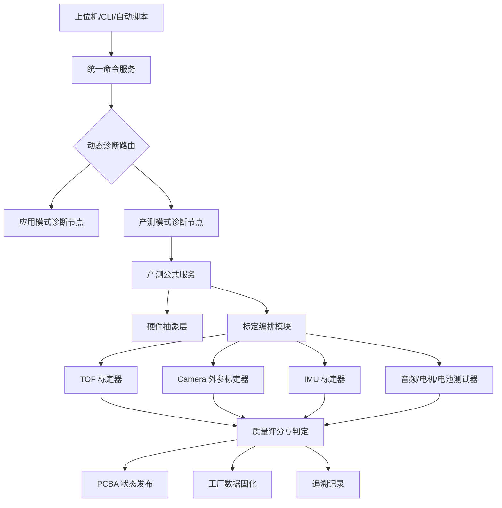
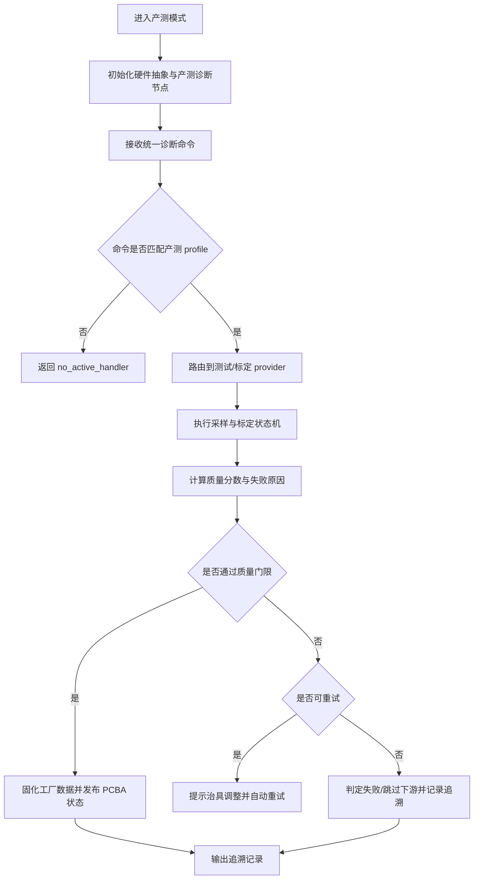

# 技术交底书

**案件名称**：一种宠物机器人多传感器产测标定与诊断命令闭环方法及系统

**技术联系人**：
- 姓名：雷文军
- 电话：15814082410
- 邮箱：wenjun.lei@videostrong.com

**专利类型**：发明

---

## 注意事项

（1）交底书应使代理人能看懂，尤其是背景技术和详细技术方案，应写得全面、清楚、完整。

（2）技术的公开程度，应以本领域普通技术人员不需付出创造性劳动即可进行实施为准。

（3）在与代理人沟通时，对于代理人咨询的技术问题，应给予回答并按要求补充相应技术材料。

## 一、介绍相关技术背景，描述与本发明技术最相近的现有技术，并说明该现有技术存在的缺点

### 1.1 现有技术

检索说明：在 Google Patents 及公开网络资料中，以“移动机器人 多传感器 标定”“机器人 sensor fusion calibration”“robot production test diagnostic command”“camera TOF IMU calibration”等为检索词进行检索；部分公开文本与著录项以 Google Patents 页面复核。

| 技术方向 | 公开资料 | 技术方案概括 | 局限性 |
| --- | --- | --- | --- |
| 移动机器人多传感器联合标定 | CN105758426A，Combined calibration method for multiple sensors of mobile robot，https://patents.google.com/patent/CN105758426A/en | 该方案针对移动机器人中摄像头与二维激光雷达，利用相机内参、相机位姿、雷达位姿和多时刻数据求解二者之间的旋转矩阵与平移矩阵。 | 重点在传感器间外参求解，未公开量产产测模式隔离、统一诊断命令、PCBA 实时状态发布、工厂数据固化和失败自动处置闭环。 |
| 多方向传感器融合标定设备 | CN114440957A，Sensor fusion calibration equipment and method thereof，https://patents.google.com/patent/CN114440957A/en | 该方案通过标定板、机器人承载平台、角度调整转台和控制系统，使机器人上不同方向的多个传感器可对准标定面并获取标定结果。 | 重点在标定治具结构和多方向传感器一次性对准，未覆盖宠物机器人量产中 TOF、Camera、IMU、音频、电机、电池等多项 PCBA 检测与诊断命令统一路由。 |
| 一般机器人在线或工位标定 | 例如 WO2014060516A1，Method for in-line calibration of an industrial robot，https://patents.google.com/patent/WO2014060516A1/en | 该类方案通常利用固定光源、光学位置传感器、机械臂运动或工位约束完成在线标定。 | 多面向工业机械臂或工位位置校正，缺少面向消费级宠物机器人小型硬件、多传感器 PCBA 测试、产测/应用模式隔离和追溯数据模型。 |

检索总结：现有公开技术分别解决“传感器外参如何求解”或“治具如何对准多个传感器”的问题，但并未形成面向宠物机器人量产的“产测运行体隔离、统一诊断命令、标定状态机、质量评分、工厂固化、PCBA 发布和失败智能处置”闭环。

### 1.2 现有技术存在的缺点

1. 产测链路割裂：单项测试脚本之间缺少统一状态机，无法表达 TOF、摄像头、IMU 等标定项之间的依赖关系。
2. 诊断入口不统一：应用诊断、产测诊断、上位机工装和研发 CLI 往往使用不同协议，导致命令复用和现场维护困难。
3. 标定质量不可追溯：现有方案常仅输出外参或单项结果，缺少命令 ID、失败阶段、质量分数、重试次数和固化路径。
4. 应用业务干扰产测：正常应用中的 AI、导航、音视频、网络和运动控制线程可能占用资源，影响标定采样稳定性。
5. 自动化决策不足：现有工装多依赖人工判读，无法根据质量分数和失败类型自动重试、跳过、降级或判废。

## 二、针对上述缺点，说明本发明所要解决的技术问题

本发明要解决的技术问题是：在宠物机器人量产、返修和现场维护过程中，如何通过统一诊断命令协议和独立产测模式，对多种传感器和执行器进行自动检测、自动标定、质量评分、结果固化和追溯，并避免正常应用业务对产测准确性的干扰。

进一步地，本发明解决：产测模式与应用模式解耦、统一命令路由、TOF/Camera/IMU 标定编排、PCBA 状态实时发布、工厂数据可靠写入、失败自动处置和量产追溯问题。

## 三、本发明技术方案的详细阐述

### 3.1 背景

宠物机器人通常集成摄像头、TOF、IMU、麦克风、扬声器、电机、红外、Wi-Fi/BT、电池、按键和显示等模块。其产测不仅要判断硬件是否连通，还要形成供应用模式使用的标定数据。本发明将产测模式作为独立运行体，使其复用硬件抽象层和诊断框架，但与正常应用任务隔离。

### 3.2 系统框图

<!--  -->

### 3.3 模块功能说明

1. 模式管理模块：负责在应用模式和产测模式间切换；产测模式启动独立产测运行体，应用模式启动正常业务运行体。
2. 命令服务模块：负责协议接入、解析、限流、超时和路由，不直接执行业务标定。
3. 产测诊断节点：在产测 profile 下注册 PCBA 检测、模块检测、标定、老化和版本查询命令。
4. 硬件抽象模块：屏蔽 GPIO、UART、I2C、ADC、PWM、TOF、IMU、AI/AO、VI、IR、电机和电池差异。
5. 标定编排模块：以策略表或统一标定器接口调度不同标定流程，使新增标定项不改变主流程。
6. 结果与追溯模块：将实时状态、工厂固化结果和追溯记录关联到同一命令 ID 与测试项 ID。

### 3.4 系统流程说明

<!--  -->

流程说明：系统先隔离进入产测运行体，再按产测 profile 接收命令。每个测试项通过 provider 执行，标定编排模块轮询状态并进行质量判定。通过项写入工厂分区并发布 PCBA 状态；失败项根据失败类型进行重试、跳过或判废。

### 3.4.1 符号与公式

| 符号 | 含义 | 下标/量纲 |
| --- | --- | --- |
| \(Q_{\mathrm{tof}}\)<!--  --> | TOF 质量分数 | 0 至 1 |
| \(r_{\mathrm{valid}}\)<!--  --> | TOF 有效点比例 | 0 至 1 |
| \(d_{\mathrm{mean}}\)<!--  --> | TOF 平均距离 | 米或毫米 |
| \(d_{\mathrm{target}}\)<!--  --> | 治具目标距离 | 米或毫米 |
| \(\sigma_d^2\)<!--  --> | 距离方差 | 距离平方 |
| \(e_{\mathrm{rep}}\)<!--  --> | 相机重投影误差 | 像素 |
| \(b_{\mathrm{gyro}}\)<!--  --> | 陀螺零偏 | rad/s |
| \(s_{\mathrm{imu}}\)<!--  --> | IMU 比例因子 | 无量纲 |

TOF 质量分数可表示为：

\[
Q_{\mathrm{tof}} = w_1 r_{\mathrm{valid}} + w_2 \left(1-\frac{|d_{\mathrm{mean}}-d_{\mathrm{target}}|}{\Delta_d}\right) + w_3 \left(1-\frac{\sigma_d^2}{\Delta_\sigma}\right) - w_4 r_{\mathrm{outlier}} \tag{1}
\]
<!--  -->

其中 \(w_1,w_2,w_3,w_4\)<!--  --> 为预设权重，\(\Delta_d\)<!--  --> 为距离容差，\(\Delta_\sigma\)<!--  --> 为方差容差，\(r_{\mathrm{outlier}}\)<!--  --> 为异常点比例。若式 (1) 中任一归一化项超出 0 至 1 范围，可按预设上下界截断。

摄像头外参合格条件可表示为：

\[
e_{\mathrm{rep}}\leq E_{\max},\quad h_{\min}\leq h_{\mathrm{cam}}\leq h_{\max},\quad \theta_{\min}\leq \theta_{\mathrm{pitch}}\leq \theta_{\max} \tag{2}
\]
<!--  -->

IMU 合格条件可表示为：

\[
|b_{\mathrm{gyro}}|\leq B_{\max},\quad |s_{\mathrm{imu}}-1|\leq S_{\max},\quad |\theta_{\mathrm{mount}}|\leq A_{\max} \tag{3}
\]
<!--  -->

### 3.5 关键技术参数

| 符号 | 参数名称 | 示例范围或约束 | 作用 |
| --- | --- | --- | --- |
| \(Q_{\mathrm{tof}}\)<!--  --> | TOF 质量分数 | 0 至 1，高于阈值为合格 | 判断 TOF 检测和标定是否通过 |
| \(e_{\mathrm{rep}}\)<!--  --> | 重投影误差 | 像素级阈值 | 判断相机外参可靠性 |
| \(b_{\mathrm{gyro}}\)<!--  --> | 陀螺零偏 | 预设小量阈值内 | 判断 IMU 静止采样质量 |
| \(s_{\mathrm{imu}}\)<!--  --> | IMU 比例因子 | 接近 1 | 判断旋转积分比例误差 |
| \(T_{\mathrm{timeout}}\)<!--  --> | 标定超时 | 按传感器类型配置 | 防止流程卡死 |
| \(N_{\mathrm{retry}}\)<!--  --> | 重试次数 | 非负整数 | 控制自动重试上限 |

## 四、与现有技术相比，本发明具有哪些优点？

1. 将应用模式和产测模式隔离，减少正常业务线程对产测采样的干扰。
2. 通过统一诊断命令和动态路由，使产测、研发调试和现场维护复用同一协议入口。
3. 通过策略表或统一标定器接口编排 TOF、Camera、IMU 等流程，便于扩展新传感器。
4. 将质量分数、失败原因、PCBA 状态和工厂固化结果绑定，增强量产追溯能力。
5. 支持根据失败类型和质量分数自动重试、跳过、降级或判废，提高自动化程度。

## 五、本发明的技术关键点和欲保护点是什么？

1. 产测模式与应用模式隔离但共享硬件抽象层和统一诊断协议的系统架构。
2. 基于动态诊断命令路由的产测命令注册、profile 隔离、限流、超时和错误语义机制。
3. 以统一标定器接口或策略表编排 TOF、Camera、IMU 等多传感器标定流程的方法。
4. 将 TOF 距离质量、相机外参质量、IMU 零偏/比例/安装角质量统一量化判定的方法。
5. 将实时 PCBA 状态、工厂固化数据和追溯记录关联到同一统一结果模型的方法。
6. 根据失败类型、质量分数和重试次数自动执行重试、跳过、降级、判废或治具提示的方法。

## 六、其它

### 实施例

在一台宠物机器人产测工位中，设备进入产测模式后禁用非必要 AI 与导航任务，启动产测诊断节点。上位机下发 TOF 标定命令，系统采集距离阵列并计算 \(Q_{\mathrm{tof}}\)<!--  -->。通过后进入摄像头外参标定，检测标定板角点并求解相机高度、俯仰角和重投影误差。随后执行 IMU 旋转标定，估计零偏、比例因子和安装角。所有合格结果写入工厂数据区，并输出包含命令 ID、批次、质量分数、失败原因和固件版本的追溯记录。

### 数据结构与自动化闭环示例

统一诊断命令可采用层级化命令字和结构化参数组合，例如 `factory.calib.tof.start`、`factory.calib.camera.poll`、`factory.pcba.status.get` 和 `factory.result.persist`。每条命令记录请求序号、profile、超时时间、调用者身份、目标传感器、参数版本和幂等标识，命令服务模块仅执行路由、限流、超时和错误语义转换，实际采样与标定由对应 provider 执行。

统一结果模型可包括如下字段：

| 字段 | 示例 | 用途 |
| --- | --- | --- |
| `cmd_id` | `factory.calib.tof.start` | 关联诊断命令与结果 |
| `profile` | `factory` | 区分产测、研发、售后等命令域 |
| `sn` / `batch` | 设备序列号和批次号 | 支撑批次追溯 |
| `sensor` | `tof`、`camera`、`imu` | 标识测试或标定对象 |
| `quality_score` | 0 至 1 | 统一质量判定 |
| `failure_type` | `fixture_adjust`、`hard_fail`、`dependency_skip` | 驱动自动重试、治具提示或判废 |
| `raw_digest` | 原始采样摘要或哈希 | 避免保存大体积原始数据仍可追溯 |
| `factory_blob` | 版本、长度、CRC、签名 | 支撑工厂数据完整性校验 |

由此，系统不是简单记录测试结果，而是把命令、provider 生命周期、质量分数、失败处置和工厂固化写入同一闭环。该闭环可进一步统计单板测试耗时、自动重试次数、治具调整次数、误判恢复次数和批次异常集中度，为产线节拍优化和现场维护提供可审计依据。

### 技术效果

该实施例可减少人工切换测试工具，降低应用线程干扰，提升标定结果一致性，并使批次质量问题可追溯。
