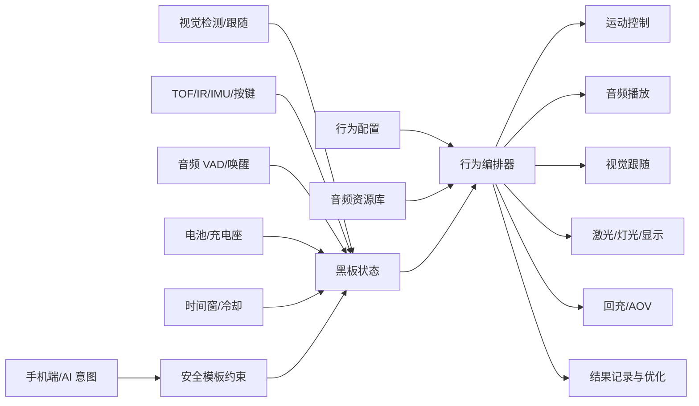
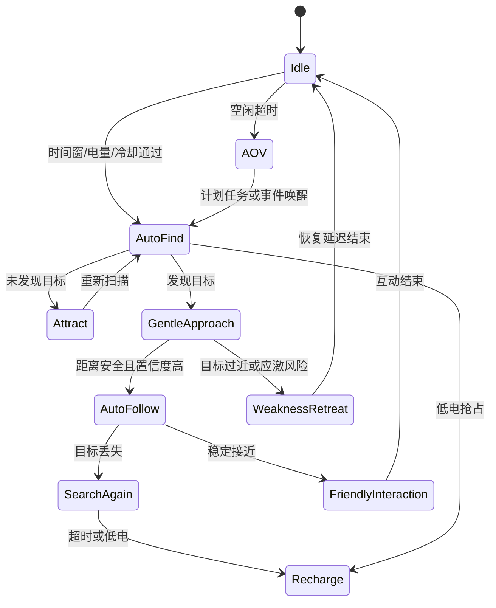

# 技术交底书

**案件名称**：一种宠物机器人端侧多模态陪伴行为自动编排方法及系统

**技术联系人**：
- 姓名：雷文军
- 电话：15814082410
- 邮箱：wenjun.lei@videostrong.com

**专利类型**：发明

---

## 注意事项

（1）交底书应使代理人能看懂，尤其是背景技术和详细技术方案，应写得全面、清楚、完整。

（2）技术的公开程度，应以本领域普通技术人员不需付出创造性劳动即可进行实施为准。

（3）在与代理人沟通时，对于代理人咨询的技术问题，应给予回答并按要求补充相应技术材料。

## 一、介绍相关技术背景，描述与本发明技术最相近的现有技术，并说明该现有技术存在的缺点

### 1.1 现有技术

检索说明：在 Google Patents 及公开网络资料中，以“pet robot interaction”“robot emotional state of pet”“remote pet interaction device”“autonomous mobile body audio output stimulus”等为检索词进行检索。

| 技术方向 | 公开资料 | 技术方案概括 | 局限性 |
| --- | --- | --- | --- |
| 远程宠物互动设备 | US9826715B2，Remote interaction device，https://patents.google.com/patent/US9826715B2/en | 该方案公开带摄像头、激光指示器、扬声器、无线收发器和处理器的远程宠物互动设备，用户可远程观察并控制宠物互动。 | 重点在远程视音频和激光互动，未公开端侧根据视觉、TOF、IMU、电池、时间窗、VAD 和任务冷却自动编排行为。 |
| 宠物情绪表达机器人 | US12358154B2，Robot for expressing emotional state of pet and control method thereof，https://patents.google.com/patent/US12358154B2/en | 该方案通过摄像头、AI 模型和运动控制识别宠物情绪，并使机器人执行与宠物情绪对应的动作。 | 重点在识别宠物情绪并表达，未覆盖自动寻宠、温和接近、弱势撤退、AOV 观察、回充抢占和 AI/手机意图安全模板化。 |
| 交互式机器人伴侣 | US8909370B2，Interactive systems employing robotic companions，https://patents.google.com/patent/US8909370B2/en | 该方案公开机器人可在自主、半自主或远程模式下，根据声音、触摸、动作或视觉刺激执行社交或情感交互动作。 | 面向机器人伴侣通用交互，缺少专门针对宠物友好策略的距离降音量、目标丢失处理、任务冷却和端侧行为结果反馈优化。 |

检索总结：现有公开方案覆盖远程宠物互动、宠物情绪识别和通用机器人伴侣交互，但未形成面向宠物机器人的“端侧多模态状态、黑板、行为优先级、自动寻宠、宠物友好动作、VAD 门控、AI 意图安全落地和结果反馈优化”闭环。

### 1.2 现有技术存在的缺点

1. 行为孤立：寻宠、跟随、靠近、播放音频、激光互动、回充和低功耗观察之间缺少统一编排。
2. 传感器融合不足：视觉目标丢失、TOF 近距离、IMU 抱起/倾倒、电池低电、时间段限制和语音触发常被各模块独立处理。
3. 宠物友好策略不足：直接靠近、持续追踪或大音量播放容易惊扰宠物。
4. 自动化程度低：设备往往等待用户遥控，而不是在工作日、时间窗、电量和冷却满足时主动寻宠。
5. AI 意图边界不清：若 AI 或手机端指令直接控制硬件，容易绕过端侧安全约束。

## 二、针对上述缺点，说明本发明所要解决的技术问题

本发明要解决的技术问题是：如何在宠物机器人端侧，将视觉、音频、运动、TOF、IMU、电池、时间窗、任务配置和用户或 AI 意图统一映射为可自动编排的陪伴行为，使机器人既能主动寻宠和互动，又能在靠近、失联、低电、抱起、倾倒和宠物不适时自动调整策略。

## 三、本发明技术方案的详细阐述

### 3.1 背景

本发明将宠物机器人的陪伴行为抽象为可配置模板，并通过消息主题总线接入视觉、传感器、运动、音频、电池和用户意图等状态。行为编排器基于黑板状态进行优先级仲裁，生成运动、音频、激光、显示、回充或低功耗观察指令。

### 3.2 系统框图

<!--  -->

### 3.3 模块功能说明

1. 配置中心：加载寻宠、自动跟随、温和接近、弱势撤退、友好互动、AOV 和回充等行为模板。
2. 消息主题总线：连接 sensor、motion、vision、audio、laser、battery 等主题域。
3. 黑板状态模块：保存宠物检测、目标置信度、目标距离、目标丢失时长、VAD、电池、充电、倾斜、抱起、冷却和当前行为状态。
4. 行为编排器：根据配置和黑板状态进行优先级、互斥、抢占和恢复。
5. 宠物友好约束模块：在距离过近、目标丢失、抱起、倾倒或互动过频时限制运动和音频强度。
6. 意图安全模板模块：将手机端或 AI 助手意图转换为白名单行为模板参数。
7. 反馈优化模块：根据行为结果调整寻宠时间、重试间隔、音频权重、运动速度和撤退距离。

### 3.4 系统流程说明

<!--  -->

流程说明：系统在空闲状态下依据时间窗、电量和冷却判断是否启动自动寻宠。未发现目标时播放吸引音频，发现目标后进入温和接近或跟随。若目标过近、疑似应激、抱起、倾倒、低电或系统升级保护等高优先级事件发生，则抢占当前行为并执行安全动作。

### 3.4.1 符号与公式

| 符号 | 含义 | 下标/量纲 |
| --- | --- | --- |
| \(C_{\mathrm{pet}}\)<!--  --> | 宠物视觉检测置信度 | 0 至 1 |
| \(D_{\mathrm{pet}}\)<!--  --> | 宠物目标距离 | 米 |
| \(T_{\mathrm{lost}}\)<!--  --> | 目标丢失持续时间 | 秒 |
| \(B_{\mathrm{bat}}\)<!--  --> | 电池电量 | 百分比 |
| \(V_{\mathrm{vad}}\)<!--  --> | VAD 窗口语音活动帧数 | 非负整数 |
| \(V_{\mathrm{th}}\)<!--  --> | VAD 触发阈值 | 非负整数 |
| \(P_{\mathrm{act}}\)<!--  --> | 行为优先级分数 | 无量纲 |

自动寻宠启动门禁可表示为：

\[
G_{\mathrm{find}} = [B_{\mathrm{bat}}\geq B_{\min}] \land [T_{\mathrm{cool}}\geq T_{\min}] \land [W_{\mathrm{time}}=1] \tag{1}
\]
<!--  -->

VAD 门控条件可表示为：

\[
G_{\mathrm{vad}} = [V_{\mathrm{vad}}\geq V_{\mathrm{th}}] \tag{2}
\]
<!--  -->

宠物友好动作选择可表示为：

\[
A_{\mathrm{safe}}=\mathrm{retreat},\quad D_{\mathrm{pet}} < D_{\min} \tag{3}
\]
<!--  -->

\[
A_{\mathrm{safe}}=\mathrm{follow},\quad C_{\mathrm{pet}}\geq C_{\min} \land D_{\mathrm{pet}}\geq D_{\min} \tag{4}
\]
<!--  -->

\[
A_{\mathrm{safe}}=\mathrm{search},\quad T_{\mathrm{lost}}\geq T_{\max} \tag{5}
\]
<!--  -->

### 3.5 关键技术参数

| 符号 | 参数名称 | 示例范围或约束 | 作用 |
| --- | --- | --- | --- |
| \(C_{\mathrm{pet}}\)<!--  --> | 视觉置信度 | 0 至 1 | 判断是否进入跟随或接近 |
| \(D_{\mathrm{pet}}\)<!--  --> | 目标距离 | 正数 | 判断降音量、接近或撤退 |
| \(T_{\mathrm{lost}}\)<!--  --> | 目标丢失时间 | 非负秒数 | 判断重搜或回充 |
| \(B_{\mathrm{bat}}\)<!--  --> | 电池电量 | 0 至 100% | 判断离桩、回充和任务抢占 |
| \(V_{\mathrm{vad}}\)<!--  --> | VAD 活动帧数 | 非负整数 | 判断是否进入语音识别 |
| \(P_{\mathrm{act}}\)<!--  --> | 行为优先级 | 预设等级 | 执行抢占仲裁 |

### 3.6 冲突仲裁与 AI 意图落地矩阵

行为编排器在黑板状态中维护候选行为集合、当前执行行为、抢占原因、恢复点和冷却计时器。对每个候选行为计算安全等级、任务等级、用户意图等级和宠物友好约束等级，并依据下表执行仲裁：

| 冲突场景 | 仲裁结果 | 保护动作 | 记录字段 |
| --- | --- | --- | --- |
| 自动寻宠遇到低电或回充需求 | 回充抢占寻宠 | 停止吸引音、低速回桩 | `preempt_reason=low_battery` |
| AI 助手要求高速追逐 | 拒绝直接执行并降级为温和接近模板 | 限速、限时、限制音量 | `intent_rewrite=safe_approach` |
| 宠物距离过近但用户要求继续跟随 | 宠物友好约束优先 | 后退、降低音量、进入冷却 | `pet_safe_guard=near_distance` |
| 抱起或倾倒时存在播放/运动任务 | 安全抢占所有低优先级行为 | 停止电机、播放轻提示 | `preempt_reason=lift_or_tilt` |
| 语音唤醒与自动寻宠同时触发 | 用户显式命令优先，但受安全约束限制 | 暂停寻宠并执行白名单命令 | `command_source=vad_user` |

手机端或 AI 助手输入不直接映射为电机、激光或扬声器底层指令，而是先被解析为 `intent_type`、`target_pet`、`duration`、`speed_level`、`sound_category`、`interaction_radius` 等高层参数。系统随后执行字段白名单校验、范围裁剪、互斥检查、宠物友好约束检查和恢复策略生成。只有通过校验的意图才会写入黑板并进入行为仲裁；未通过校验的意图会被拒绝、改写为安全模板或要求用户确认。

## 四、与现有技术相比，本发明具有哪些优点？

1. 在端侧完成多模态状态融合和行为仲裁，网络不可用时仍可执行基础陪伴。
2. 将寻宠、跟随、接近、撤退、友好互动、AOV 和回充组织为统一行为闭环。
3. 通过距离降音量、低速接近、目标过近撤退和互动冷却降低惊扰风险。
4. 将 AI 或手机端意图转换为白名单模板并校验，避免直接控制硬件。
5. 通过冲突仲裁矩阵记录抢占原因、意图改写和安全保护动作，使行为决策可审计。
6. 根据行为执行结果调整后续策略，使陪伴体验可持续优化。

## 五、本发明的技术关键点和欲保护点是什么？

1. 端侧多模态黑板状态与行为编排器结合的方法。
2. 基于视觉、TOF、IMU、电池、时间窗和音频状态的行为优先级仲裁方法。
3. 配置驱动的自动寻宠、温和接近、友好互动和弱势撤退行为模板。
4. 根据目标距离和行为阶段动态调整音频类型、播放音量和运动速度的方法。
5. VAD 门控语音链路与宠物陪伴行为编排联动的方法。
6. AI 助手或手机端高层意图到端侧安全行为模板的转换和校验方法。
7. 基于行为结果统计自动调整寻宠时间、音频权重、运动速度和撤退策略的方法。

## 六、其它

### 实施例

在工作日 9:30 至 19:00 的时间窗内，若电池电量满足离桩条件且冷却时间结束，机器人自动离开充电座执行寻宠。视觉未发现目标时，系统选择猫语或猎物声作为吸引音频；发现目标后根据 \(C_{\mathrm{pet}}\)<!--  --> 和 \(D_{\mathrm{pet}}\)<!--  --> 判断温和接近或跟随。当目标距离过近时，系统降低音量并进入弱势撤退；目标丢失超过阈值时，系统重搜或回充。用户通过手机端或 AI 助手输入的自然语言意图被转换为白名单参数，经过范围、安全和冲突校验后才生效。

### 技术效果

该实施例可提升主动陪伴能力，降低惊扰宠物的风险，并使自动寻宠、跟随、互动和回充之间形成端侧闭环。
